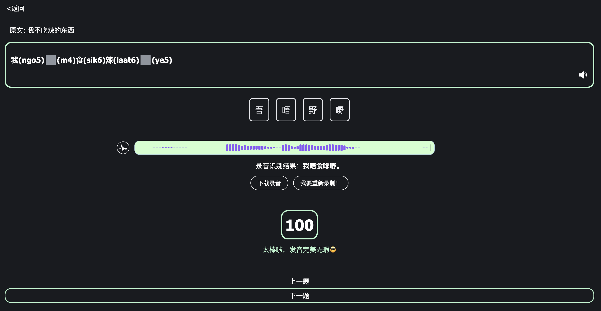
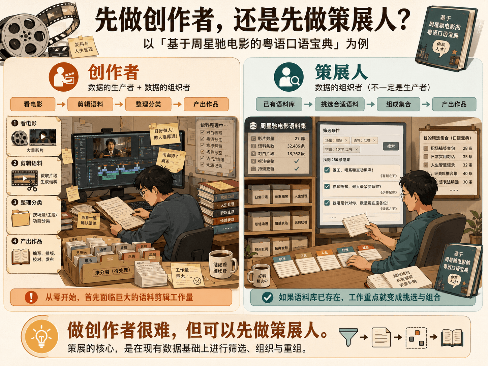

# 构建一个极简语言学习系统

## 1 语言学习元认知

> **注：** 本文的很多内容参考自： [https://1000h.org/intro.html](https://1000h.org/intro.html)，特此感谢

### 1.1 学习一门语言的目的到底是什么？

如果要人们回答这个问题，最普遍的答案会基于实用主义的交流 —— **学习一门语言的意义在于使用。**

因此，英语在需求程度上最强烈，毕竟人类的绝大多数知识与智慧就是用英语记录并传播的。其他语言的需求程序视这门语言在世界上的地位而定。

然而，如果我们换一个角度 ——

> **掌握并不断提高自然语言使用能力**，是最佳的**健脑**方式 —— 完全没必要在这个陈述之后再附加上 “之一”，因为它就是**最佳健脑方式**。**自然语言**是人类终其一生可以遇到的最复杂最系统的知识，一切其它的知识技能都建立在其基础之上，无论是学也好还是练也罢，没有止境。也因此，所有人都可以，事实上也应该，终其一生去培养并发展对自然语言的驾驭能力。
>
> —— [https://1000h.org/intro.html](https://1000h.org/intro.html)
>
> —— 如果想了解更多关于「健脑」的内容，可以 [点击查看原文](https://1000h.org/intro.html) ，在此不再延展。
### 1.2 失败的语言教育系统

不得不说，已有的语言教育系统是失败的。大多数人从小就开始学英语，十几年的青春都在努力达成「掌握英语」这个目标，但是最终效果不佳。

一部分人会把原因归结于自己 —— 我没有语言学习的天分；另一部分人会把原因归结于客观条件 —— 没有沉浸式的语言环境，或者，没有外教能陪我联系……

然而，如果我们观察一下小朋友的语言学习，会发现上述的理由都站不住脚。**小朋友从 18 个月左右开始牙牙学语，前后经过差不多 30 ～ 36 个月左右达成吐字清晰，在 6 岁前后已经精通一门语言。**

> 曾经，每个人都的确是天才，却最终大多都被教育成了笨蛋 —— 相信我，**人傻都是被教出来的**。
>
> https://1000h.org/training-tasks/ground.html#_4-%E4%BB%BB%E5%8A%A1%E5%B9%B6%E4%B8%8D%E9%AB%98%E7%BA%A7


所以，我们想要做的事情简单明了 ——

> 承认现有的面向成人的语言教育系统是失败的，抛弃它，想想作为语言学习天才的小朋友们是怎样进行语言学习的，设计一个遵循这种学习方法的 App。


### 1.3 只有模仿

学习语言的最有效的方法只有 **模仿**。小朋友们不会先读一本词汇书、再读一本语法书、然后再找一本书专门讲怎么阅读理解……

唯一的方法论就是 **简单粗暴的模仿** 。父母和他说一句 「你好」，然后他模仿之后便掌握了一句 「你好」。随着时间推移，掌握的句子越来越多……

所以，我们为何不设计这样一个语言学习 App，它的最基础功能就是模仿和评分？

[粤语跟读小游戏 Demo](https://shadowing.app.aidimsum.com/) ：



**由于我们现在已经有了一个现成的 [粤语语料库](https;//search.aidimsum.com)，所以，我们计划用「粤语」作为这个理念的第一个实验标的。**

用户将可以在 [所有语料集](https://search.aidimsum.com/library) 中选择他喜欢的语料集作为学习资料。例如，需要用于日常交流的学习者选择 「粤语万句多用途场景语料集」，而想要学习粤语的小朋友选择 「小猪佩奇粤语版」。**学习资料的更新将和语料库本身的数据更新保持同步。**

### 1.4 分享功能

模仿功能之后的第二个核心是分享功能，跟读内容通过分享用户的「创作」进行传播。 **是的，跟读也是一种创作。** 所以，用户进行跟读之后，结果天然地就适合分享到相关社区。

### 1.5 启动实验！

我们想要做的，只不过是让大家在学习一事上找回很久以前的自己。来，一起尝试，开启这场实验。


## 2 人人都能创作教材

### 2.1 只有通用教材的过去

这是一个不得不承认的事实 ——

> 学校里或者市面上的口语教材之所以没用，是因为它们都不是**个性化**的。说实话，这也是没办法的事情，既然是**大众教材**或者**大众教育**，那么就必然只能假定**大家都是一样的** —— 在这个隐含的假定之下，不可能存在什么为你定制的个性化教材。
>
> **通用教材**，尤其是**口语书**的一个隐患在于，它想无所不包，它什么都想教你，毕竟，如果一本口语书竟然并不全面，那么就根本卖不出去 —— 出发点是好的，可效果却是注定没有的 —— 因为实际上你需要的并不是什么都会，而是 “**我会的我想的，我就能说**”。
>
> 举个例子，一个以 “星巴克” 为场景的对话，若是追求完整的话，感觉上我们所需要学的东西实在是太多了 —— 很奇怪的是，我们在咖啡馆里几乎从来不说 *coffee* 这个词 —— 拿铁、美式咖啡、焦糖玛奇朵、卡布奇诺、脱脂牛奶，低因，糖浆，榛果味糖浆，到底要几泵糖浆…… 可是，对我来说，永远是 *latte*，*hot*，*medium*，然后呢？然后就没了，真的没了。人家看我自己一个人，又不是外卖的装扮，通常也不会问几杯；如果人家竟然真的问了，我可能并不需要说话，只需要伸出一个手指头就行了……
>
> 这就是为什么天下没有什么口语书的确适合你的根本原因 —— 每个人都太不一样了，每个人的感受不同，想法不同，经历不一样，表达方式不一样，哪儿哪儿都不一样，否则，为什么要交流呢？结果呢？教科书里十句里只有一句我自己用的上的，我想说的十句里有九句教科书里没有…… 这能有效吗？我们必须想办法定制属于我们自己的**个性化口语书**……
>
> —— https://1000h.org/training-tasks/revolution.html#_3-8-%E9%A1%B6%E7%BA%A7%E5%A4%96%E6%95%99

如果进一步延伸，在过去，所有的教材都是 **「缺乏个性化定制」** 的通用教材。

* 我是港片爱好者，但市面上不会有一本以「无间道三部曲」为素材的粤语教材；
* 我想成为游戏开发者，但编程教材里并没有「游戏案例」；
* ……

现在 AI 已然突破了奇点，我们或许可以来点不一样的。

### 2.2 AI 时代，人人都可以是超级生产者

**每个人其实都是特定领域的专家，只要知道了「那个领域」是什么。**

例如，我是周星驰电影的超级粉丝，那么编写一份「基于周星驰电影的粤语口语宝典」，我可能会比语言学专家更有优势；

例如，我是资深火锅爱好者，那么编写一份「中国火锅地图」，我可能会比其他美食博主更胜一筹……


然而，即使是专家，要最终产出作品，还是有很多具体的细节阻碍。依然是「基于周星驰电影的粤语口语宝典」这个例子，如果我从零开始，那么从电影里剪辑出语料会是我首先面临的工作量。

所以，在这个 App 里，我们是否可以从「最简可行路径」开始？

做一个「创作者」是高门槛的，**但是否可以先做一个「策展人」？**

```
生产者
  |-------+
  ↓       ↓
创作者   策展人
```

什么是创作者？创作者即是数据的生产者，也是数据的组织者；什么又是策展人？策展人是数据的组织者，但不一定是数据的生产者。

还是「基于周星驰电影的粤语口语宝典」的例子，如果语料库中本身已经存在了「周星驰电影语料集」的话，那么策展人的工作量会简化为「挑选合适的语料组成集合」。




在 `1 语言学习元认知` 一节中，最后阐述了我们会在这个 App 中开启一场面向 `学习者` 的实验 ——  **让大家在学习一事上找回很久以前的自己。**

关于 `2 人人都能创作教材` 这一节，我们同样也试图开启一场实验，但是这场实验面向的是 `生产者` —— **让大家用「策展」这一方法创作个性化教材**。

## 3 功能实现

[✓] 可用 & 简洁的跟读语料集实现

[✓] 来自 `DimSum Search System` 的任意语料的跟读功能

[&nbsp;&nbsp;] 创作者通过「策展」的方式创建教材

[&nbsp;&nbsp;] 构建「粤语学习者」用户社区

[&nbsp;&nbsp;] 在社区组织跟读活动


